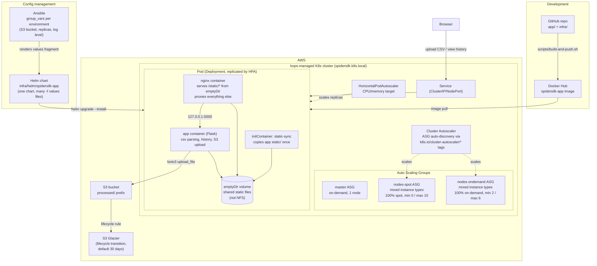

# Architecture

## Overview

## Layers

1. **kops cluster** (`infra/kops/`) — a `.k8s.local` cluster with
   three instance groups: on-demand control-plane, on-demand worker
   pool, spot worker pool. Both worker pools use kops'
   `mixedInstancesPolicy` across several instance types for capacity
   flexibility, and both carry the same `k8s.io/cluster-autoscaler/*`
   `cloudLabels` so a single Cluster Autoscaler deployment auto-discovers
   and scales every instance group.

2. **Application pod** (`infra/helm/spidersilk-app/templates/deployment.yaml`) —
   one Deployment, one Pod, two long-running containers (`nginx`, `app`) plus
   an `initContainer` that copies the app image's `static/` (css, js) into a
   pod-local `emptyDir` volume before the main containers start. `nginx`
   serves `/static/*` straight from that volume and reverse-proxies
   everything else to the Flask app over `127.0.0.1:5000` — same pod, same
   network namespace, no NFS or other external storage involved.

3. **Exposure & scaling** — a `Service` (ClusterIP by default, NodePort for
   Minikube) fronts the pod; a `HorizontalPodAutoscaler` (CPU + memory
   targets, `autoscaling/v2`) scales the Deployment's replica count. Cluster
   Autoscaler (layer 1) then adds/removes nodes as the HPA's scheduling
   pressure requires.

4. **Config management** (`infra/ansible/`) — Ansible's `group_vars` per
   environment (`minikube`, `production`) are the source of truth for
   application configuration (S3 bucket name, region, replica bounds, log
   level). The `app_config` role renders that into a Helm values fragment,
   which is layered on top of the chart's own `values.yaml` with
   `helm upgrade -f values.yaml -f generated/<env>-app-config.yaml`.

5. **Web application** (`app/`) — Flask app: `/` to upload a CSV,
   `/upload` parses it (unheadered `sku,description,price` rows) and renders
   the parsed lines, `/history` lists previously processed files, and
   `/history/<id>` re-displays a past file's rows. Each processed file's
   metadata + rows are written as one small JSON record (`app/records.py`) —
   to S3 under `records/` when `S3_BUCKET` is set, to a local directory
   otherwise, so the same code path works with or without AWS. `records/` is
   a separate prefix from `processed/` (the raw CSVs) and excluded from the
   Glacier lifecycle rule, so history stays instantly readable no matter how
   old the source file is. Every processed file is also pushed to S3 under
   `processed/<name>`; if no AWS credentials/bucket are configured the
   upload step degrades to a visible "skipped" status rather than failing
   the request.

6. **S3 + Glacier** (`infra/s3/`) — Terraform (with an `aws-cli` fallback)
   provisions a private, versioned, encrypted bucket with a lifecycle rule
   transitioning everything under `processed/` to Glacier after 30 days
   (configurable) — see `infra/s3/README.md`.

7. **Images** — the app is built from `app/Dockerfile` and pushed to Docker
   Hub with `scripts/build-and-push.sh`; nginx uses the stock
   `nginx:1.27-alpine` image, configured entirely via a mounted ConfigMap.

## Known trade-offs (explicitly out of scope for this case study)

- **History persistence without a bucket**: when `S3_BUCKET` is unset
  (local/Minikube by default), records fall back to the pod's `emptyDir`,
  so they don't survive a pod restart and aren't shared across HPA-scaled
  replicas. This only affects that local-only fallback — once a real bucket
  is configured, history is S3-backed, durable, and shared across replicas.
